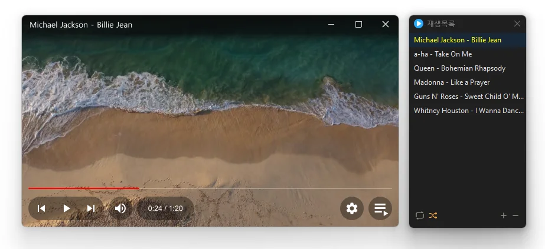

# KPlayer

**Um player de vídeo gratuito e limpo, sem anúncios.**

[English](README.md) · [한국어](README.ko.md) · [简体中文](README.zh-CN.md) · [日本語](README.ja.md) · [Español](README.es.md) · Português (Brasil) · [Français](README.fr.md)

> Este documento é uma tradução. Em caso de divergência, prevalece a [versão em coreano](README.ko.md).

> A interface do programa não tem tradução para português; ela é exibida em inglês. Os nomes de botões e opções abaixo aparecem como na tela.

## Visão geral

O KPlayer é um player de vídeo e música sem anúncios e sem excessos. Ele é construído sobre o mecanismo de mídia de código aberto **libmpv**, então reproduz de imediato 38 formatos — 23 de vídeo, 12 de áudio e 3 de lista de reprodução — sem instalar nenhum codec.

A janela mostra apenas o vídeo; os controles aparecem na parte de baixo só quando você move o mouse. Solte um arquivo na janela e ele começa a tocar, e ao abrir um episódio de uma série, os episódios seguintes da mesma pasta entram na lista em ordem.

Todos os atalhos de teclado e ações do mouse podem ser alterados, e as legendas podem ser personalizadas em detalhes, até a fonte, a cor, o contorno e a posição.

## Recursos

- **38 formatos** — 23 formatos de vídeo, incluindo MP4, MKV, AVI, MOV, WMV, WebM, TS, M2TS, VOB e RM/RMVB; 12 formatos de áudio, incluindo MP3, FLAC, AAC, M4A, WAV, OGG, Opus, WMA, APE e DSF; e 3 formatos de lista de reprodução (M3U, M3U8, PLS).
- **Nenhum codec para instalar** — tudo o que é preciso para a reprodução já vem incluído.
- **Aceleração por hardware** — mantém fluidos até os vídeos de alta resolução.
- **Arrastar e soltar** — solte na janela principal para substituir a lista e tocar na hora, ou na janela da lista de reprodução para adicionar à lista. Solte uma pasta e apenas os arquivos de mídia dela são adicionados.
- **Próximos episódios adicionados automaticamente** — ao abrir um arquivo, os arquivos relacionados da mesma pasta (Episódio 1, Episódio 2…) entram na lista em ordem.
- **Lista de reprodução** — arraste para reordenar, repetição (todos ou um), ordem aleatória, e a lista é lembrada depois que você fecha o programa.
- **Legendas** — mostrar/ocultar, troca de faixa, fonte, tamanho, cor, negrito, contorno, sombra, posição e alinhamento, e escolha automática do idioma da legenda conforme o idioma de exibição do Windows.
- **Controle da reprodução** — pular capítulos, avançar quadro a quadro, velocidade (0,25×–4,0×), capturas de tela (JPG/PNG).
- **Painel de informações** — pressione `TAB` para ver de relance os dados do arquivo, codec, resolução, quadros e áudio.
- **Normalização de volume** — reduz a diferença entre sons baixos e altos (intensidade ajustável).
- **Atalhos e mouse personalizáveis** — defina teclas para 30 ações e escolha o que fazem o clique, o clique duplo, o botão do meio e a roda.
- **Associação de arquivos** — registre os tipos de arquivo um a um nas configurações e abra direto o seletor de aplicativos padrão do Windows.
- **Visual limpo** — janela escura sem bordas, sempre visível, lembra a posição e o tamanho da janela.

## Download / Instalação

| Pacote | Link |
|---|---|
| Instalador | [Baixar](https://down.kilho.net/kplayer?lang=pt) |
| Portátil (ZIP) | [Baixar](https://down.kilho.net/kplayer?lang=pt&nosetup) |

Para a versão portátil, descompacte o ZIP em qualquer lugar e execute `KPlayer.exe`.

Ao terminar a instalação, o instalador associa ao KPlayer os arquivos mais comuns, como MP4, MKV, AVI, MOV, WMV, WebM, TS, MP3, FLAC, M4A e WAV. A versão portátil não mexe nas associações; registre as que quiser em Settings → **File types**.

## Como usar

### Primeiros passos

1. Ao iniciar o KPlayer, a tela inicial mostra o **logotipo do KPlayer** no centro.
2. Arraste um arquivo de vídeo ou de música para a janela. Você também pode clicar no logotipo ou pressionar `Ctrl+O` para escolher um arquivo.
3. A reprodução começa na hora. Mova o mouse e os controles aparecem na parte de baixo; deixe-o parado por um momento e eles somem.
4. `Space` pausa, `←` `→` pulam 5 segundos, `↑` `↓` ajustam o volume. `Enter` ou um clique duplo coloca em tela cheia, e `ESC` volta.
5. O botão da lista de reprodução, no canto inferior direito, abre a janela da lista, e o botão de engrenagem ao lado abre as configurações (Settings).

### A janela

**Janela do player**

| Elemento | O que faz |
|---|---|
| Barra superior | Nome do arquivo em reprodução. À direita: alfinete (sempre visível) · minimizar · tela cheia · fechar |
| Barra de progresso | Clique ou arraste para ir a outro ponto. Passe o mouse para ver o tempo daquele ponto em um balão; se o arquivo tiver capítulos, aparecem marcas de capítulo |
| ⏮ ▶ ⏭ | Arquivo anterior / reproduzir-pausar / próximo arquivo |
| Alto-falante | Clique para silenciar. Passe o mouse para abrir a barra de volume |
| Tempo | Posição atual / duração total |
| Legendas | Mostrar/ocultar legendas — aparece só em arquivos com legendas |
| Engrenagem | Configurações (Settings) |
| Lista | Abrir/fechar a janela da lista de reprodução |

Arraste qualquer ponto da janela para movê-la e arraste uma borda para redimensioná-la. Ao mudar o volume ou a velocidade, o novo valor aparece por um instante no centro da tela.

**Menu do botão direito**

| Menu | O que faz |
|---|---|
| Open file / Open folder | Escolher um arquivo ou pasta, adicionar à lista e reproduzir |
| Screen size | 50% · 100% · 150% · 200% do tamanho do vídeo, Full screen, Full screen (stretched) |
| Created by Kilho | Abre o site |

**Janela da lista de reprodução**

| Botão | O que faz |
|---|---|
| Repeat | Alterna entre No repeat → Repeat all → Repeat one |
| Shuffle | Liga/desliga a ordem aleatória |
| + | Adicionar — File / Folder |
| − | Remover — Selected files / Unselected files / All items / Missing files |

Dê um clique duplo em um item para reproduzi-lo; a tecla `Delete` tira os itens selecionados da lista (os arquivos em si não são excluídos). O item em reprodução aparece em outra cor.

### Como…

**Assistir a uma série em ordem a partir do episódio 1**
Basta abrir um episódio. O KPlayer procura na mesma pasta arquivos cujos nomes seguem uma numeração (`Episódio 1`·`Episódio 2`, `S01E01`·`S01E02` e assim por diante) e os coloca na lista em ordem numérica — `2` vem antes de `10`. Se você abrir o episódio 3, a lista começa no episódio 1, mas a reprodução começa no episódio 3.
- Abrir um vídeo não puxa os arquivos de música da mesma pasta, e abrir uma música não puxa os vídeos.
- Para adicionar todos os arquivos do mesmo tipo da pasta, defina Settings → **General → Auto-add files in folder** como **All files**; para adicionar só o arquivo que você abriu, defina como **Off**.

**Começar uma lista nova / adicionar ao final da lista**
Solte arquivos na **janela principal** e a lista atual é esvaziada e substituída pelos arquivos soltos, que começam a tocar na hora. Solte-os na **janela da lista de reprodução** e eles são adicionados depois da lista existente, tocando a partir do primeiro adicionado. Um arquivo que já está na lista nunca entra duas vezes.

**Adicionar uma pasta inteira**
Arraste uma pasta para a janela ou use o botão direito → **Open folder**. O KPlayer procura também nas subpastas e adiciona apenas os arquivos que consegue reproduzir; imagens, documentos e outros arquivos são ignorados automaticamente.

**Abrir vários arquivos pelo Explorador de Arquivos**
Selecione vários arquivos no Explorador de Arquivos e pressione Enter: todos vão para uma única janela do KPlayer já aberta, o primeiro arquivo toca e os demais entram na lista. O que acontece quando o KPlayer já está aberto é definido em Settings → **General → If already running**.
- **Play in running player** (padrão) — o arquivo recém-aberto toca na janela que já está aberta.
- **Add to running playlist** — continua tocando o que você estava assistindo e só adiciona à lista. Prático para juntar músicas enquanto ouve.
- **Allow multiple** — abre uma nova janela para cada arquivo. Use para comparar dois vídeos lado a lado.

**Abrir listas de reprodução M3U ou PLS**
Abra ou solte um arquivo de lista de reprodução e as faixas indicadas nele entram na lista e tocam a partir da primeira. Caminhos escritos em relação à pasta do arquivo de lista funcionam, assim como listas salvas no Bloco de Notas com nomes com acentos ou em outros alfabetos.

**Ouvir músicas em ordem aleatória**
Ative o botão **Shuffle** na janela da lista de reprodução. Nenhuma faixa se repete até a lista inteira tocar; depois de uma volta completa, a lista é embaralhada de novo e a reprodução continua. O botão anterior (⏮) volta pela ordem em que você realmente ouviu. Passe o mouse sobre o botão para ver a descrição do modo atual.

**Repetir uma faixa / repetir a lista sem parar**
Clique no botão **Repeat** da janela da lista de reprodução para mudar para **Repeat one** ou **Repeat all**. Repeat one tem prioridade mesmo com a ordem aleatória ligada. Com No repeat, a reprodução para no fim da lista, mantendo o último quadro na tela.

**Reordenar a lista**
Segure um item e arraste para cima ou para baixo. Selecione vários itens com `Ctrl` ou `Shift` para movê-los juntos. Arraste até a borda de cima ou de baixo e a lista rola sozinha.

**Manter na lista arquivos de um pen drive ou de uma unidade de rede**
Desconectar a unidade não tira os arquivos dela da lista; esses itens passam a ser mostrados com o caminho completo. Quando chega a vez de um deles, um aviso rápido "File not found" aparece na tela e o KPlayer passa para o próximo arquivo. Reconecte a unidade e os itens voltam ao normal sozinhos. Para retirar os arquivos que realmente não existem mais, use **− → Missing files** na janela da lista de reprodução.

**Manter a lista para a próxima vez**
Com Settings → **General → Save playlist** ligado (padrão), a lista que você tinha ao fechar o KPlayer volta na próxima vez. Mesmo que você inicie o KPlayer com um clique duplo em um arquivo no Explorador de Arquivos, é esse arquivo que toca, e não a primeira faixa da lista antiga. Para começar sempre com a lista vazia, defina como **Off**.

**Ligar as legendas**
As legendas começam desligadas. Ao abrir um arquivo com legendas, um **botão de legendas** aparece na parte de baixo; clique nele ou pressione `V`. Arquivos de legenda com o mesmo nome do vídeo (`filme.srt`, `filme.pt.srt` e assim por diante) são carregados automaticamente.
- Para sempre mostrar as legendas, defina Settings → **Subtitles → Show subtitles by default** como **On**.
- Se houver várias faixas de legenda, troque com `J` / `Shift+J`.
- Em arquivos MKV com várias faixas, o KPlayer escolhe primeiro as legendas no idioma de exibição do Windows e, se não houver, em inglês. Para preferir outros idiomas, liste-os em ordem em **Preferred subtitle languages**, por exemplo `ja,jpn,en,eng`.

**Deixar as legendas mais legíveis ou mudar o tamanho e a posição**
Em Settings → **Subtitles**, altere o tamanho, a fonte, o negrito, a cor do texto, a espessura e a cor do contorno, a sombra, a posição vertical e o alinhamento. As mudanças aparecem na hora no player, então você pode ajustar enquanto assiste. Para descer as legendas para a faixa preta abaixo do vídeo, ajuste **Vertical position**.
Para legendas com efeitos e estilos (ASS), como as de karaokê, defina **Prefer subtitle file style** como **On** para que apareçam do jeito definido no arquivo de legenda.

**Assistir a aulas e reuniões mais rápido**
`C` acelera em 0,1×, `X` desacelera, `]` / `[` mudam em 10%, e `Z` volta para 1,0×. O intervalo vai de 0,25× a 4×, e a velocidade atual aparece por um instante no centro da tela a cada mudança.

**Encontrar a cena exata que você quer**
`Shift+←` / `Shift+→` movem exatamente 1 segundo, e `,` / `.` avançam ou recuam um quadro. Em vídeos com capítulos, `Ctrl+←` / `Ctrl+→` pulam entre capítulos, e os capítulos também aparecem marcados na barra de progresso.

**Salvar uma cena como imagem**
Pressione `S` e o quadro atual é salvo na sua **Área de Trabalho** com um número adicionado ao nome do arquivo, como `filme.mp4-0001.jpg`. Mude a pasta e o formato (JPG/PNG) em Settings → **General → Screenshot folder / Format**. Escolha PNG para imagens sem perda de qualidade.

**Assistir em uma janela pequena enquanto trabalha**
Clique no botão **alfinete** da barra superior e a janela fica sempre por cima das outras (a janela da lista de reprodução também). Reduza a janela e deixe-a em um canto da tela. O botão direito → **Screen size → 50%** reduz de uma vez para a metade do tamanho do vídeo.

**Escolher o tamanho da janela ao abrir um vídeo**
Escolha em Settings → **General → Window size on play**.
- **Keep last size** (padrão) — o tamanho que você sempre usa.
- **Fit to video size** — ajusta a janela ao tamanho original de cada vídeo. Se for maior que a tela, ela é reduzida para caber, mantendo a proporção.
- **Full screen** — começa em tela cheia assim que um vídeo é aberto.

A posição e o tamanho da janela são lembrados depois que você fecha o KPlayer e, se aquele monitor tiver sido desconectado, a janela abre em uma tela visível.

**Preencher a tela com um vídeo de outra proporção**
O botão direito → **Screen size → Full screen (stretched)** estica o vídeo por todo o monitor, sem faixas pretas. Ao sair da tela cheia, a proporção original volta. Se você usa muito, defina o clique duplo como **Stretched full screen / restore** em Settings → **Mouse**.

**Igualar o volume que varia de um vídeo para outro**
A **normalização de volume** vem ligada por padrão: ela aumenta os diálogos baixos e reduz os efeitos altos. Para diminuir ainda mais a diferença, defina Settings → **Audio → Normalization strength** como **Strong**; para ouvir o som original, defina **Use volume normalization** como **Off**. O volume inicial é definido em **Default volume**.
Aumentar o volume enquanto está silenciado tira o silêncio automaticamente.

**Avançar e voltar com a roda em vez de mudar o volume (mudar as ações do mouse)**
Em Settings → **Mouse**, escolha uma função para Left button single click, Left button double click, Middle button click, Wheel up e Wheel down. Por exemplo, defina a roda como **Seek forward / Seek backward**, o clique simples como **Play/Pause** e o botão do meio como **Play next file**.

**Usar as teclas com que você está acostumado**
Em Settings → **Shortcuts**, selecione uma ação, clique na caixa abaixo e pressione a tecla (ou combinação de teclas) que quiser. **Clear** remove uma tecla, e **Default shortcuts** restaura as originais. Você também pode definir teclas para **Playlist**, **Settings** e **Always on top**, que não têm tecla por padrão. Os atalhos padrão são:

| Tecla | Ação |
|---|---|
| `Space` | Reproduzir/pausar |
| `Enter` | Tela cheia (`ESC` para sair) |
| `←` / `→` | Voltar / avançar 5 s |
| `Shift+←` / `Shift+→` | Voltar / avançar 1 s (exato) |
| `Ctrl+←` / `Ctrl+→` | Capítulo anterior / próximo |
| `,` / `.` | Quadro anterior / próximo |
| `↑` / `↓` | Volume +5 / −5 |
| `0` / `9` | Volume +2 / −2 |
| `M` | Silenciar |
| `Page Up` / `Page Down` | Arquivo anterior / próximo |
| `V` | Mostrar/ocultar legendas |
| `J` / `Shift+J` | Faixa de legenda seguinte / anterior |
| `S` | Captura de tela |
| `X` / `C` | Velocidade −0,1 / +0,1 |
| `[` / `]` | Velocidade −10% / +10% |
| `Z` | Velocidade 1.0x |
| `Ctrl+O` | Abrir arquivo |
| `TAB` | Painel de informações (fixo) |

**Ver os detalhes do arquivo (codec, resolução, taxa de bits)**
Pressione `TAB` durante a reprodução para ver em uma só tela o nome, o formato e o tamanho do arquivo, o codec, a resolução e a taxa de quadros do vídeo, se a decodificação por hardware está em uso, o codec, os canais e a taxa de amostragem do áudio, a faixa de legenda e o volume. As informações são atualizadas a cada segundo; pressione `TAB` de novo para fechar.

**Abrir arquivos de vídeo no KPlayer com um clique duplo**
Em Settings → **File types**, marque as extensões que quiser. **Common types** marca os formatos mais usados e **Select all** marca todos os 38; cada um é registrado no momento em que você o marca. Os arquivos registrados pelo KPlayer ganham um ícone por extensão.
No Windows 10 e 11, você precisa escolher o aplicativo padrão por conta própria, então as extensões cujo aplicativo padrão é outro programa mostram a marca **[Not applied]**. Clique na marca para abrir direto o seletor de aplicativos padrão do Windows e escolha o KPlayer. **Open Windows default apps settings** abre as Configurações do Windows para você mudar tudo de uma vez.
- Se você mover a pasta portátil para outro lugar, as associações passam a apontar para o novo local na próxima vez que você executar o KPlayer.
- Desinstalar a versão instalada devolve ao estado anterior todas as associações registradas pelo KPlayer.

**Restaurar as configurações**
Clique em **Default** na parte de baixo da janela Settings para voltar todas as configurações, atalhos e ações do mouse aos valores padrão. As associações de arquivo não mudam.

**Ajustar a saída de vídeo à sua placa de vídeo**
Em Settings → **Video**, escolha **Hardware decoding** (Auto (safe) / Auto / Disabled), **Output driver**, **Graphics API** (Auto / Direct3D 11 / OpenGL / Vulkan), **Display sync**, **Upscaler** e **Deinterlace**. Na maioria dos casos, os valores padrão são os melhores. As configurações deste cartão passam a valer na próxima vez que você iniciar o KPlayer.

## Configuração

As configurações são alteradas nos cartões da janela Settings e salvas imediatamente (o cartão **Video** passa a valer depois de reiniciar).

| Cartão | Item | Padrão |
|---|---|---|
| General | Repeat mode · Shuffle | No repeat · Off |
| | Save playlist | On |
| | Auto-add files in folder | Related files only |
| | If already running | Play in running player |
| | Screenshot folder · Format | Desktop · JPG |
| | Always on top | Off |
| | Window size on play | Keep last size |
| Video | Hardware decoding · Output driver · Graphics API · Display sync · Upscaler · Deinterlace | Auto (safe) · gpu · Auto · Display resample · lanczos · Auto |
| Audio | Default volume | 100 |
| | Use volume normalization · Normalization strength | On · Medium |
| Subtitles | Show subtitles by default | Off |
| | Subtitle size · Preferred subtitle languages | 55 · Idioma de exibição do Windows + inglês |
| | Font · Bold · Text color · Outline width · Outline color · Shadow · Vertical position · Alignment | (Default) · Off · White · 3 · Black · 0 · 100 · Center |
| | Prefer subtitle file style | Off |
| File types | Register per extension · Default app picker | O instalador registra os tipos comuns |
| Shortcuts | Teclas para 30 ações | Tabela acima |
| Mouse | Single click · Double click · Middle button · Wheel up/down | Do nothing · Full screen / restore · Do nothing · Volume up/down |

As configurações e a lista de reprodução ficam na mesma pasta do programa, então mover a pasta portátil leva tudo junto.

O idioma da interface segue o idioma de exibição do Windows (coreano, inglês, japonês, chinês, russo, italiano, francês, espanhol, árabe — inglês para os demais idiomas).

## Requisitos

- Windows 10 ou Windows 11, **64 bits**
- Nenhum codec ou componente adicional precisa ser instalado.
- A Internet é usada apenas para avisos de nova versão.

## Atualizações

O KPlayer **não** se atualiza sozinho. Ao iniciar, ele verifica se há uma nova versão e mostra um aviso; se você optar por obtê-la, a página de download é aberta e o programa é fechado. Novas versões são publicadas manualmente após verificação interna e anunciadas na [página do KPlayer](https://kilho.net/kplayer). Veja o [aviso sobre a política de atualizações](https://en.kilho.net/archives/notice/2940).

**Histórico de versões**

| Versão | Data | Notas |
|---|---|---|
| 1.1.0 | 2026-09-29 | Opções para reproduzir na janela já aberta ou adicionar à lista dela, adição automática dos próximos vídeos da mesma pasta, abrir vários arquivos começa pelo primeiro selecionado, janela de configurações mais organizada, menu de tamanho da tela com 50%·100%·150%·200%, mais estabilidade e compatibilidade com sistemas atuais |
| 1.0.0 | 2026-09-13 | Abrir arquivos e pastas pela tela inicial, pelo menu do botão direito e com `Ctrl+O`; abertura mais fácil dos 38 formatos; associação dos arquivos comuns e ícones de arquivo logo após a instalação; inicialização mais confiável; ações do mouse e atalhos personalizáveis |
| 0.9.9 | 2026-09-11 | Configuração das ações do mouse, configuração de atalhos (29 ações), idioma de legenda automático, botão sempre visível, personalização de fonte/cor/contorno/sombra/posição das legendas, menu de tamanho da tela, tamanho da janela ao reproduzir, posição e tamanho da janela lembrados, janela de configurações mais organizada |
| 0.9.8 | 2026-09-05 | Salvamento das configurações mais confiável, mais estabilidade e resposta mais rápida em geral |

## Compilar a partir do código-fonte

O código é público em [github.com/newkilho/KPlayer](https://github.com/newkilho/KPlayer). Ele é compilado com o [Lazarus](https://www.lazarus-ide.org/) 4.x (FPC 3.2.2, Win64) e precisa de:

- [LibMPVDelphi](https://github.com/nbuyer/libmpvdelphi) — as units de ligação com a libmpv
- `laz.virtualtreeview_package` — o pacote Virtual Treeview que vem com o Lazarus
- `libmpv-2.dll` ao lado de `KPlayer.exe` na hora de executar

Copie `Const-sample.inc` para `Const.inc` e compile com `lazbuild KPlayer.lpi`. No entanto, uma biblioteca compartilhada (klib), responsável pela verificação de atualizações, pela tradução e mais, fica fora do repositório, portanto o executável não pode ser gerado apenas com o repositório.

## Contribuindo

Relatos de bugs e sugestões são bem-vindos via GitHub Issues ou pelo [fórum](https://kilho.top/forum/qna).

## Licença

O programa KPlayer é **Freeware**. Use-o gratuitamente em qualquer lugar — no trabalho, em casa, em órgãos públicos e em escolas — e redistribua-o livremente em qualquer lugar.

O código-fonte é licenciado sob a **GNU GPL v2 ou posterior**. Os componentes de código aberto usados, incluindo o mecanismo de reprodução libmpv (GPL-2.0-or-later), estão listados em `THIRD-PARTY-NOTICES.txt` na pasta de instalação.

## Links

- Site: <https://kilho.net/kplayer>
- Código-fonte: <https://github.com/newkilho/KPlayer>
- Fórum: <https://kilho.top/forum/qna>
- X (Twitter): <https://www.twitter.com/kilhonet>

© KILHO.NET
